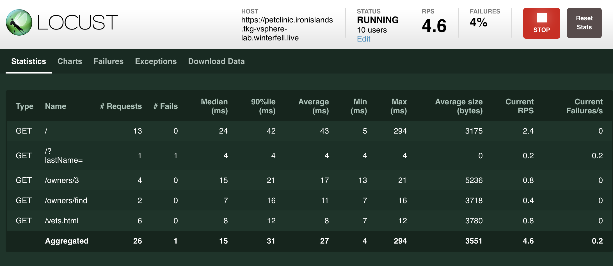

# Setup Load Generation for More Interesting Dashboards

The following approach was borrowed by the TSM demo which uses [acme-fitness](https://github.com/vmwarecloudadvocacy/acme_fitness_demo/tree/master/traffic-generator).

# Requirements

1. Needs Python3.6 and above

2. Locust - [Locust](https://docs.locust.io/en/stable/installation.html)

3. Spring Pet Clinic

# Steps

1. Set environment variables for use in the following sections

```bash
export PETCLINIC_HOST=$(yq r $PARAMS_YAML petclinic.host)
```
2. Install requirements for locust script

```bash
pip3 install -r traffic-generator/requirements.txt
```

3. Run locust

```bash
locust --host=https://$PETCLINIC_HOST --locustfile traffic-generator/locustfile.py
```

3. Access Locus UI

```bash
open http://localhost:8089
```

4. Click on 'New Test' and provide the number of users to simulate.   I used 10 users with hatch rate 4




5. Check out your nice data flowing through on your custom TO dashboard


